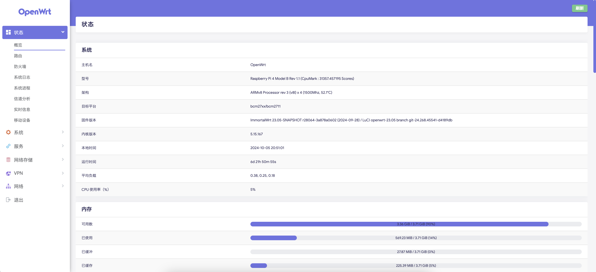
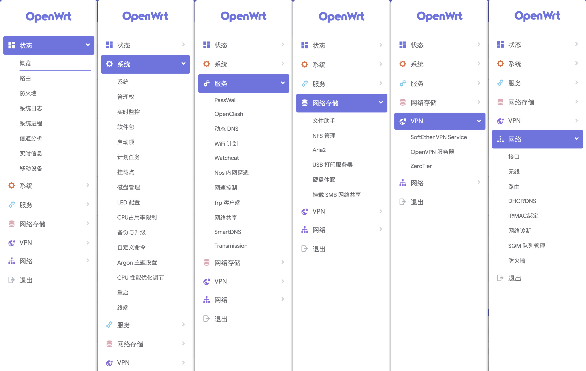

# Openwrt-Rpi4

## Openwrt23.05 for Raspberry Pi 4

由于 [SuLingGG](https://github.com/SuLingGG/) 大佬结束了对 OpenWrt18.06 自编译固件 [OpenWrt-Rpi](https://github.com/SuLingGG/OpenWrt-Rpi) 的维护，但是我已经习惯了使用 OpenWrt-Rpi 固件，所以我决定自己维护一个基于 Openwrt23.05 的OpenWrt-Rpi4 固件。

由于本人仅有一台 Raspberry Pi 4B 版本，所以只能维护这个版本的固件，如果你有其他版本的 Raspberry Pi，可以自行编译。

## 固件预览

### 主界面

### 内置应用

## 鸣谢

感谢以下项目 / 厂商:

| Github Actions                                        | OpenWrt 源码项目                                             | OpenWrt 构建项目                                             | Action 项目                                                  |
| ----------------------------------------------------- | ------------------------------------------------------------ | ------------------------------------------------------------ | ------------------------------------------------------------ |
| [Github Actions](https://github.com/features/actions) | [openwrt/openwrt](https://github.com/openwrt/openwrt/)       | [openwrt/buildbot](https://git.openwrt.org/?p=buildbot.git;a=summary) | [ncipollo/release-action](https://github.com/ncipollo/release-action) |
|                                                       | [coolsnowwolf/lede](https://github.com/coolsnowwolf/lede)    | [P3TERX/Actions-OpenWrt](https://github.com/P3TERX/Actions-OpenWrt) | [mknejp/delete-release-assets](https://github.com/mknejp/delete-release-assets) |
|                                                       | [immortalwrt/immortalwrt](https://github.com/immortalwrt/immortalwrt) | [immortalwrt/opde](https://github.com/immortalwrt/opde)      | [GitRML/delete-workflow-runs](https://github.com/GitRML/delete-workflow-runs) |
|                                                       |                                                              | [aparcar/openwrt](https://github.com/aparcar/openwrt)        | [easingthemes/ssh-deploy](https://github.com/easingthemes/ssh-deploy) | [HostHatch](https://hosthatch.com/)      |
|                                                       |                                                              | [klever1988/nanopi-openwrt](https://github.com/klever1988/nanopi-openwrt) | [easimon/maximize-build-space](https://github.com/easimon/maximize-build-space) |
|||[SuLingGG/OpenWrt-Rpi](https://github.com/SuLingGG/OpenWrt-Rpi)||

